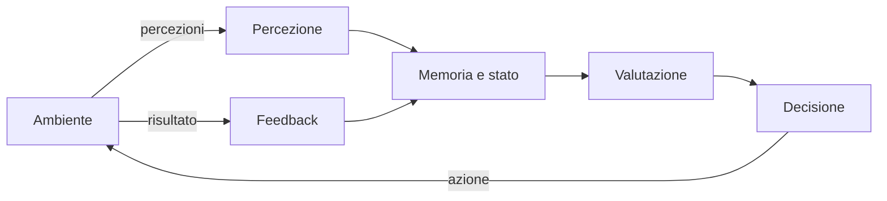
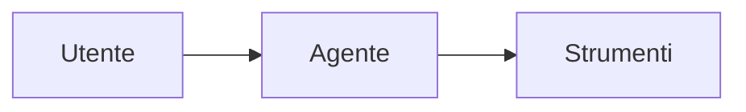
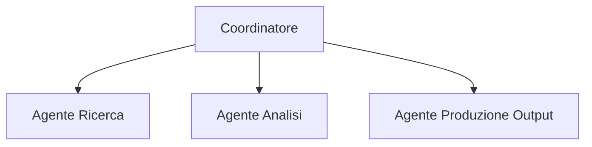
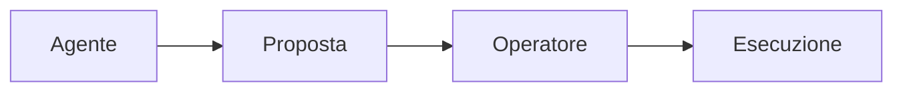
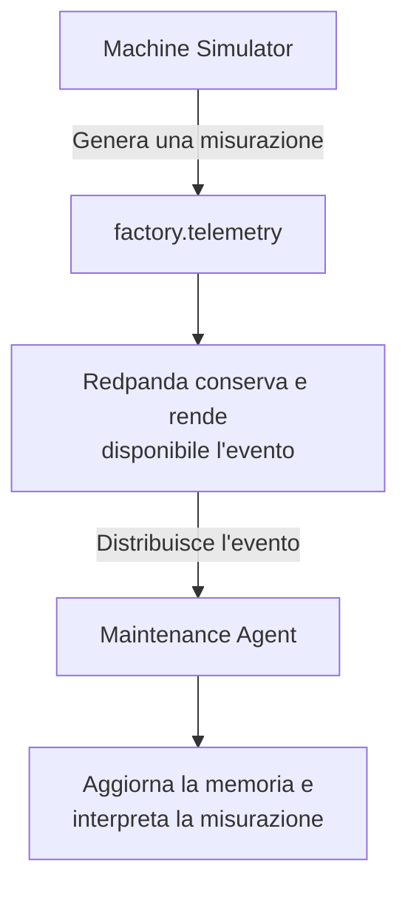
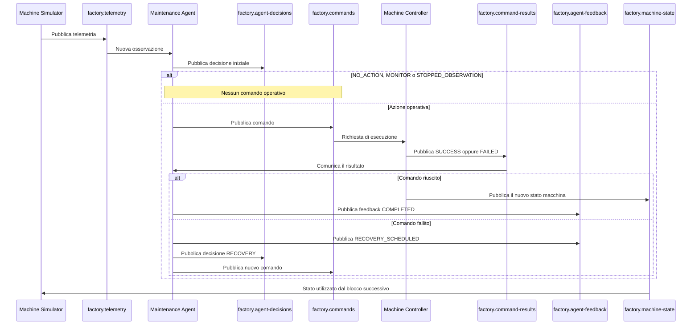

# Agenti software


> **Idea chiave:** un agente non si limita a trasferire dati. Osserva un ambiente, mantiene uno stato, applica una politica decisionale, produce azioni e usa il risultato delle azioni come feedback per l'adattamento.

---

## Che cos'è un agente

Un **agente software** è un sistema che:
1. riceve informazioni da un ambiente;
2. le interpreta rispetto a un obiettivo;
3. sceglie un'azione. 

`Agente = Percezione + Elaborazione + Azione`

Un agente può funzionare con **regole deterministiche**, **modelli statistici**, **tecniche di machine learning** oppure **modelli linguistici**. Un LLM non è quindi un requisito obbligatorio, ma rappresenta lo stato dell'arte per la maggior parte degli agenti moderni.

Le architetture agentiche possono includere **percezione**, **elaborazione**, **decisione**, **azione**, **memoria** e **feedback**. La memoria permette di conservare il **contesto** e di non trattare ogni input come un evento completamente isolato, risultano quindi elementi centrali dei sistemi agentici.



<!--
GitHub visualizza i diagrammi Mermaid direttamente nei file Markdown, quindi il diagramma rimane modificabile insieme al codice sorgente. [GitHub Docs, Creating diagrams](https://docs.github.com/en/get-started/writing-on-github/working-with-advanced-formatting/creating-diagrams)
-->
---

## Tipologie di agenti

Gli agenti possono essere classificati in base al modo in cui **prendono decisioni** e **gestiscono l'interazione con l'ambiente**.

### 1.Agenti reattivi

Rappresentano la forma più semplice di agente. Non mantengono una rappresentazione complessa dello stato del mondo e rispondono direttamente agli stimoli ricevuti.

Schema logico:

```text
SE condizione X
ALLORA azione Y
```

Esempi:

- termostati;
- sistemi antifurto;
- automazioni basate su regole.

| **Vantaggi** | **Svantaggi** |
|------------|-----------|
| Semplice da implementare| Scarsa capacità di adattamento| 
|Elevata velocità di esecuzione| Assenza di pianificazione a lungo termine|


---

### 2. Agenti orientati agli obiettivi

Prendono decisioni in funzione di un obiettivo da raggiungere.

Non si limitano a reagire agli eventi ma valutano quali azioni consentiranno di raggiungere il risultato desiderato.

```text
Stato attuale
      ↓
  Obiettivo
      ↓
 Pianificazione
      ↓
    Azione
```

Esempi:

- navigatori GPS;
- sistemi di pianificazione automatica;
- assistenti digitali che eseguono attività complesse.


| **Vantaggi** | **Svantaggi** |
|------------|-----------|
| Maggiore flessibilità | Dipendenza dal modello dell'ambiente |
| Efficienza operativa | Richiedono modelli e algoritmi<br>più sofisticati rispetto agli agenti reattivi|

---

### 3. Agenti che apprendono

Migliorano il proprio comportamento attraverso l'esperienza.

Possono utilizzare:

- Machine Learning;
- Deep Learning;
- Reinforcement Learning.

Durante l'esecuzione raccolgono feedback e aggiornano il proprio modello decisionale.

Esempi:

- sistemi di raccomandazione;
- robot autonomi;
- sistemi di previsione.

| **Vantaggi** | **Svantaggi** |
|------------|-----------|
| Riduzione dell'intervento umano | Addestramento costoso
| Le prestazioni aumentano grazie all'esperienza accumulata. | Richiedono dataset sufficienti e di<br>qualità per apprendere correttamente.|

---

### 4. Agenti basati su Large Language Model (LLM)

Gli agenti moderni sono spesso costruiti utilizzando un **Large Language Model (LLM)** come componente di ragionamento.

In questo caso il modello linguistico non rappresenta l'intero agente, ma una delle sue componenti.

Un agente basato su LLM integra generalmente:

- ragionamento tramite modello linguistico;
- memoria contestuale;
- strumenti esterni (*tools*);
- pianificazione delle attività;
- meccanismi di feedback.

Esempi:

- assistenti virtuali;
- copiloti per lo sviluppo software;
- sistemi di automazione documentale.

| **Vantaggi** | **Svantaggi** |
|------------|-----------|
| Comprensione del linguaggio naturale| Necessità di aggiornare continuamente il modello interno | Modelli avanzati possono richiedere infrastrutture e risorse significative
| Possono utilizzare API, database, motori di ricerca e applicazioni esterne | La qualità dei risultati dipende spesso dalla formulazione delle istruzioni|

---

## Architetture di implementazione

La struttura interna di un agente può variare in funzione della complessità del problema da risolvere.

### 1. Architettura Single Agent

Nell'architettura **Single Agent** un unico agente gestisce l'intero processo decisionale.



L'agente si occupa di:

- interpretare la richiesta;
- pianificare le attività;
- utilizzare gli strumenti disponibili;
- produrre il risultato finale.

| **Vantaggi** | **Svantaggi** |
|------------|-----------|
| Semplicità architetturale | Limitata scalabilità
 Minori costi di sviluppo | Minor specializzazione delle competenze

---


### 2. Architettura Multi-Agent

In un sistema **Multi-Agent** più agenti specializzati collaborano per raggiungere un obiettivo comune.



Ogni agente svolge una funzione specifica.

Esempio:

- un agente raccoglie informazioni;
- un agente esegue l'analisi;
- un agente genera il risultato finale.

| **Vantaggi** | **Svantaggi** |
|------------|-----------|
| Specializzazione delle attività | Coordinamento più complesso
  Maggiore modularità | Gestione della comunicazione tra agenti


---

### 3. Human-in-the-Loop

In alcune applicazioni l'essere umano rimane parte integrante del processo decisionale.



L'agente propone un'azione ma l'esecuzione richiede una validazione umana.

Questa architettura è comune in:

- sanità;
- finanza;
- ambiti regolamentati;
- processi aziendali critici.

---

## Differenza tra agente e programma tradizionale

Un programma tradizionale esegue una **sequenza di istruzioni** definite dallo sviluppatore.

```text
Input → Elaborazione → Output
```

Le regole operative sono generalmente statiche e il comportamento è completamente determinato dalla logica implementata.

Un agente introduce invece ulteriori capacità:

- osservazione dell'ambiente;
- mantenimento dello stato;
- valutazione del contesto;
- selezione autonoma delle azioni;
- utilizzo del feedback;
- eventuale apprendimento.


>La principale differenza consiste quindi nel **livello di autonomia**: mentre un programma tradizionale esegue istruzioni predefinite, un **agente sceglie dinamicamente il comportamento** più appropriato in funzione dello stato dell'ambiente e degli obiettivi assegnati.


---

## Componenti fondamentali di un agente

| Componente | Domanda | Implementazione nel progetto |
|---|---|---|
| Percezione | Che cosa sta accadendo? | Consumo di `factory.telemetry` |
| Memoria | Che cosa è accaduto di recente? | `MachineState` con finestre di temperatura, vibrazione e velocità |
| Valutazione | Quanto è rischiosa la situazione? | Calcolo deterministico realizzato in `risk_engine.py` |
| Decisione | Quale comportamento è opportuno? | Politica iniziale e politica di recupero definite in `policy.py` |
| Azione | Quale comando deve essere eseguito? | Pubblicazione dei comandi operativi su `factory.commands` |
| Risultato | Il controller ha applicato il comando? | Consumo di `factory.command-results` |
| Feedback | Come deve reagire l'agente al risultato? | Pubblicazione su `factory.agent-feedback` e, in caso di fallimento, generazione di una decisione di recupero |
| Stato macchina | Qual è lo stato effettivo dopo l'azione? | Pubblicazione su `factory.machine-state` da parte del Machine Controller |
| Audit | Come ricostruisco il processo? | Utilizzo di `factory.agent-decisions`, `factory.agent-feedback` e degli identificatori di correlazione |

### Percezione

E` il momento in cui **l’agente acquisisce informazioni sull’ambiente prima di aggiornare la memoria**, calcolare il rischio e prendere una decisione. 

Nel progetto, il `Machine Simulator` pubblica misurazioni strutturate come:

- temperatura;
- vibrazione;
- velocità;
- consumo energetico;
- fase operativa;
- stato della macchina;
- scenario di simulazione.

Questi dati vengono inseriti in un messaggio JSON e pubblicati sul topic `factory.telemetry`.


Il Maintenance Agent consuma due categorie di eventi:

- gli eventi di `factory.telemetry`, che rappresentano la le informazioni simulate provenienti dalla macchina;
- gli eventi di `factory.command-results`, che rappresentano l'esito delle azioni eseguite dal controller sulla macchina.

```python
consumer.subscribe(
    [
        TELEMETRY_TOPIC,
        COMMAND_RESULTS_TOPIC,
    ]
)
```

La doppia sottoscrizione permette all'agente di elaborare sia nuove osservazioni sia il feedback prodotto dal Machine Controller.

L'agente non legge soltanto sensori fisici. In un sistema event-driven, un topic può costituire l'interfaccia percettiva dell'agente.

Il flusso è:



### Memoria e stato interno

Lo stato contiene finestre limitate delle ultime temperature, vibrazioni e velocità:

```python
@dataclass
class MachineState:
    machine_id: str
    window_size: int

    temperatures: deque[float] = field(init=False)
    vibrations: deque[float] = field(init=False)
    speeds: deque[int] = field(init=False)

    last_action: str = "NO_ACTION"
    
```

Le code hanno dimensione massima configurabile:

```python
self.temperatures = deque(
    maxlen=self.window_size
)
self.vibrations = deque(
    maxlen=self.window_size
)
self.speeds = deque(
    maxlen=self.window_size
)
```

Questa è una forma di **memoria a breve termine**. Consente di calcolare medie e trend recenti senza conservare indefinitamente tutti gli eventi.

Lo stato contiene inoltre informazioni operative:

- `current_speed` conserva l'ultima velocità conosciuta;
- `machine_status` conserva lo stato operativo della macchina;
- `pending_command_id` identifica un comando in attesa di risultato;
- `pending_action` conserva l'azione associata al comando;
- `last_command_result` conserva l'ultimo esito ricevuto;
- `recovery_attempts` conta i tentativi automatici eseguiti dopo un fallimento.

Queste informazioni permettono all'agente di ricordare azioni e risultati precedenti e di non trattare ogni telemetria come un evento isolato.

### Valutazione del rischio

Il file `risk_engine.py` trasforma lo stato della macchina in un punteggio compreso tra `0.0` e `1.0`:

```python
total_risk = (
    temperature_risk * TEMPERATURE_WEIGHT
    + vibration_risk * VIBRATION_WEIGHT
    + trend_risk * TREND_WEIGHT
)

return round(min(total_risk, 1.0), 2)
```

Nel prototipo i pesi sono:

```text
TEMPERATURE_WEIGHT = 0.45
VIBRATION_WEIGHT = 0.45
TREND_WEIGHT = 0.10
```

Il 45% del rischio deriva dalla temperatura media, 
45% del rischio deriva dalla vibrazione media e il 10% dal trend recente. Il trend verifica se temperatura e vibrazione stanno aumentando progressivamente nelle ultime misurazioni.

La componente `temperature_risk` viene calcolata come segue:


```python
    temperature_risk = normalize(
        state.average_temperature(),
        NORMAL_TEMPERATURE,
        CRITICAL_TEMPERATURE,
    )
```

La funziona `normalize` confronta la temperatura media con `NORMAL_TEMPERATURE = 65.0` e `CRITICAL_TEMPERATURE = 90.0` ed il comportamento è:
```text
Temperatura media minore o uguale a 65 °C
→ temperature_risk = 0.0

Temperatura media maggiore o uguale a 90 °C
→ temperature_risk = 1.0

Temperatura media compresa tra 65 °C e 90 °C
→ temperature_risk è un valore proporzionale tra 0.0 e 1.0
```

La componente `vibration_risk` viene calcolata come segue:
```python   
    vibration_risk = normalize(
        state.average_vibration(),
        NORMAL_VIBRATION,
        CRITICAL_VIBRATION,
    )
```
La vibrazione media viene confrontata con `NORMAL_VIBRATION = 2.0` e `CRITICAL_VIBRATION = 7.0`:
```text
Vibrazione media minore o uguale a 2.0
→ vibration_risk = 0.0

Vibrazione media maggiore o uguale a 7.0
→ vibration_risk = 1.0

Vibrazione media compresa tra 2.0 e 7.0
→ vibration_risk è un valore proporzionale tra 0.0 e 1.0
```

Le funzioni non utilizzano direttamente soltanto l'ultima misurazione ricevuta, ma le medie calcolate sulla finestra di memoria:

```python
state.average_temperature()
state.average_vibration()
```

Infine la terza componente viene calcolate con:
```python
    trend_risk = calculate_trend_risk(state)
```
Il trend controlla se temperatura e vibrazione stanno aumentando progressivamente nel tempo. Se non sono ancora disponibili almeno tre misurazioni, il sistema non dispone di informazioni sufficienti per stabilire un andamento.


Il punteggio di rischio finale non rappresenta una probabilità scientificamente calibrata di guasto, ma è un indice deterministico, progettato per rendere osservabile il processo decisionale.

### Politica decisionale

Il file `policy.py` converte il rischio in un'azione:

```python
def select_action(risk_score: float) -> str:
    if risk_score >= 0.85:
        return EMERGENCY_STOP

    if risk_score >= 0.65:
        return REQUEST_INSPECTION

    if risk_score >= 0.45:
        return REDUCE_SPEED

    if risk_score >= 0.20:
        return MONITOR

    return NO_ACTION
```

| Intervallo del rischio | Decisione | Effetto operativo |
|---|---|---|
| `< 0.20` | `NO_ACTION` | Nessun comando |
| `0.20 - 0.44` | `MONITOR` | Osservazione più attenta |
| `0.45 - 0.64` | `REDUCE_SPEED` | Comando al controller |
| `0.65 - 0.84` | `REQUEST_INSPECTION` | Richiesta di manutenzione |
| `>= 0.85` | `EMERGENCY_STOP` | Arresto di emergenza |

Separare il calcolo del rischio dalla politica rende il sistema più leggibile e testabile. Le soglie possono cambiare senza riscrivere l'acquisizione degli eventi.

La selezione basata sul rischio viene affiancata da una valutazione contestuale dello stato operativo.

Se la telemetria indica:

```text
status = STOPPED
speed = 0
```

l'agente seleziona:

```text
STOPPED_OBSERVATION
```

Questa decisione viene registrata in `factory.agent-decisions`, ma non genera un comando. In questo modo l'agente osserva il raffreddamento della macchina senza richiedere ulteriori arresti.

```python
def select_contextual_action(
    telemetry: dict[str, Any],
    risk_score: float,
) -> str:
    machine_status = str(
        telemetry["status"]
    ).upper()

    current_speed = int(
        telemetry["speed"]
    )

    if machine_status == "STOPPED":
        if current_speed != 0:
            raise ValueError(
                "Una macchina con stato STOPPED "
                "deve avere velocita uguale a zero"
            )

        return STOPPED_OBSERVATION

    return select_action(risk_score)
```

Le decisioni che non generano comandi sono:

```text
NO_ACTION
MONITOR
STOPPED_OBSERVATION
```

Le decisioni operative sono:

```text
REDUCE_SPEED
REQUEST_INSPECTION
EMERGENCY_STOP
```

---

### Politica di recupero

Quando un comando **fallisce**, l'agente applica una politica di recupero e può generare una nuova decisione.

```text
REDUCE_SPEED fallisce
→ REQUEST_INSPECTION

REQUEST_INSPECTION fallisce
→ EMERGENCY_STOP

EMERGENCY_STOP fallisce
→ nuovo tentativo di EMERGENCY_STOP

Numero massimo di tentativi superato
→ MANUAL_INTERVENTION_REQUIRED
```

La selezione viene realizzata dalla funzione:

```python
def select_recovery_action(
    failed_action: str,
    recovery_attempt: int,
    max_recovery_attempts: int,
) -> str | None:
    if recovery_attempt > max_recovery_attempts:
        return None

    recovery_actions = {
        REDUCE_SPEED: REQUEST_INSPECTION,
        REQUEST_INSPECTION: EMERGENCY_STOP,
        EMERGENCY_STOP: EMERGENCY_STOP,
    }

    return recovery_actions.get(
        failed_action
    )
```

Il numero massimo di tentativi è configurato tramite `MAX_RECOVERY_ATTEMPTS`. Nel progetto il valore predefinito è `3`. Il limite impedisce che un errore persistente generi un ciclo infinito di comandi.

### Calcolo della velocità obiettivo

I comandi operativi contengono sia la velocità corrente sia la velocità da raggiungere:

```text
current_speed
target_speed
```

Per `REDUCE_SPEED`, la velocità obiettivo viene calcolata applicando una riduzione percentuale. Nel progetto la riduzione predefinita è pari al 20%.

```text
Velocità corrente: 1500
Riduzione: 20%
Velocità obiettivo: 1200
```

Per `EMERGENCY_STOP`, la velocità obiettivo è sempre `0`.

Per `REQUEST_INSPECTION`, la velocità rimane invariata. L'azione modifica lo stato operativo in `INSPECTION_REQUIRED`, ma non modifica direttamente la velocità.

---


## Decisione, comando, risultato e feedback

Questi concetti sono distinti.

| Elemento | Significato | Topic |
|---|---|---|
| Decisione | Valutazione dell'agente | `factory.agent-decisions` |
| Comando | Azione operativa richiesta al controller| `factory.commands` |
| Risultato | Esito tecnico dell'esecuzione | `factory.command-results` |
| Feedback | Interpretazione dell'esito e strategia successiva | `factory.agent-feedback` |
| Stato macchina | Stato effettivo conseguente a un comando riuscito | `factory.machine-state` |



### Feedback positivo

Un comando eseguito correttamente produce un feedback con stato `COMPLETED`:

```json
{
  "correlation_id": "abc-131",
  "action": "EMERGENCY_STOP",
  "command_result": "SUCCESS",
  "feedback_status": "COMPLETED",
  "previous_speed": 1500,
  "target_speed": 0,
  "current_speed": 0,
  "machine_status": "STOPPED",
  "state_changed": true,
  "recovery_required": false,
  "next_action": null,
  "recovery_attempt": 0,
  "max_recovery_attempts": 3
}
```

Il valore `COMPLETED` indica che il comando è stato eseguito e che l'agente ha aggiornato il proprio stato interno.

### Feedback negativo e recupero

Quando un comando fallisce, il Maintenance Agent pubblica un feedback con stato `RECOVERY_SCHEDULED`:

```json
{
  "correlation_id": "abc-130",
  "action": "REDUCE_SPEED",
  "command_result": "FAILED",
  "feedback_status": "RECOVERY_SCHEDULED",
  "previous_speed": 1450,
  "target_speed": 1160,
  "current_speed": 1450,
  "machine_status": "RUNNING",
  "state_changed": false,
  "recovery_required": true,
  "next_action": "REQUEST_INSPECTION",
  "recovery_attempt": 1,
  "max_recovery_attempts": 3
}
```

I due campi descrivono aspetti differenti:

- `command_result = FAILED` indica che il controller non ha applicato l'azione;
- `feedback_status = RECOVERY_SCHEDULED` indica che l'agente ha elaborato il fallimento e programmato una nuova strategia.

Dopo il feedback, l'agente pubblica:

1. una nuova decisione con `decision_type = RECOVERY`;
2. un nuovo comando associato alla nuova azione.

Se il numero massimo di tentativi viene superato, il feedback assume il valore:

```text
MANUAL_INTERVENTION_REQUIRED
```

In questo caso non vengono prodotti ulteriori comandi automatici.

### Stato effettivo della macchina

Il topic `factory.machine-state` contiene lo stato raggiunto dopo un comando eseguito correttamente.

```json
{
  "state_event_id": "uuid-stato",
  "source_result_id": "uuid-risultato",
  "source_command_id": "uuid-comando",
  "source_decision_id": "uuid-decisione",
  "correlation_id": "abc-131",
  "controller_id": "machine-controller-01-v2",
  "machine_id": "machine-01",
  "timestamp": "2026-09-13T18:30:10+00:00",
  "speed": 0,
  "previous_speed": 1500,
  "target_speed": 0,
  "status": "STOPPED",
  "last_applied_action": "EMERGENCY_STOP",
  "state_changed": true
}
```

Il Machine Controller pubblica un nuovo stato soltanto quando il comando ha esito `SUCCESS`.

Il Machine Simulator legge l'ultimo stato disponibile prima di produrre nuove telemetrie e seleziona uno scenario coerente:

```text
Nessuno stato precedente
→ PROGRESSIVE_DEGRADATION

Ultima azione REDUCE_SPEED
→ RECOVERY_AFTER_SPEED_REDUCTION

Stato INSPECTION_REQUIRED
→ INSPECTION_PENDING

Stato STOPPED
→ STOPPED_COOLING
```

Questa comunicazione chiude il ciclo tra azione e ambiente simulato.

---

## Perché il Maintenance Agent è un agente

Il `Maintenance Agent` non è un semplice componente di inoltro di messaggi perché:

1. percepisce telemetria da un ambiente esterno;
2. conserva misurazioni precedenti;
3. calcola uno stato sintetico di rischio;
4. sceglie dinamicamente tra più azioni;
5. spiega la decisione e distingue tra quelle iniziali e di recupero;
6. evita comandi operativi duplicati;
7. riceve l'esito delle azioni;
8. aggiorna lo stato operativo sulla base del risultato;
9. reagisce ai fallimenti scegliendo una nuova azione;
10. limita il numero di tentativi automativi.


---


Il `Maintenance Agent` è principalmente **reattivo**:

```text
riceve una telemetria
→ aggiorna lo stato
→ calcola il rischio
→ sceglie un'azione
→ osserva il risultato
→ reagisce al feedback
```

Possiede però una componente più evoluta rispetto a una semplice regola istantanea, perché utilizza:

- una finestra temporale di osservazioni;
- medie recenti di temperatura, vibrazione e velocità;
- trend crescenti;
- ultima azione selezionata;
- ultimo risultato ricevuto;
- stato operativo della macchina;
- presenza di un comando in attesa;
- numero di tentativi di recupero;
- politica di escalation dopo un fallimento.

Il Maintenance Agent non apprende modificando autonomamente i propri parametri. L'adattamento è deterministico e deriva dallo stato interno, dalla telemetria e dal feedback ricevuto dal controller.


---

## Riferimenti

- IBM, [What are the components of AI agents?](https://www.ibm.com/think/topics/components-of-ai-agents)
- IBM, [What is AI agent memory?](https://www.ibm.com/think/topics/ai-agent-memory)
- Microsoft, [Memory for AI Agents](https://microsoft.github.io/ai-agents-for-beginners/13-agent-memory/)
- Microsoft Learn, [AI Agent Orchestration Patterns](https://learn.microsoft.com/en-us/azure/architecture/ai-ml/guide/ai-agent-design-patterns)
- GitHub Docs, [Creating diagrams](https://docs.github.com/en/get-started/writing-on-github/working-with-advanced-formatting/creating-diagrams)
