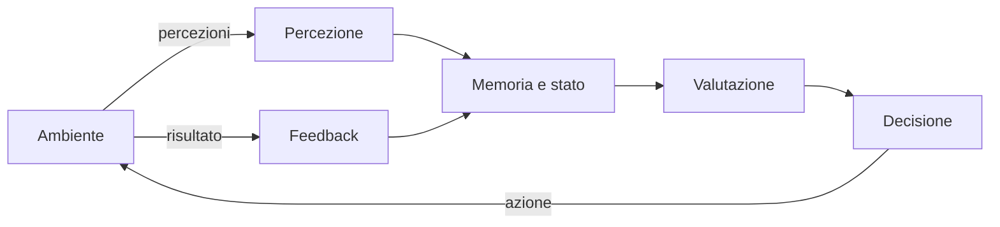
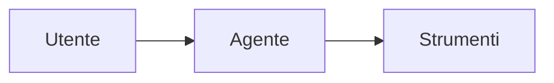
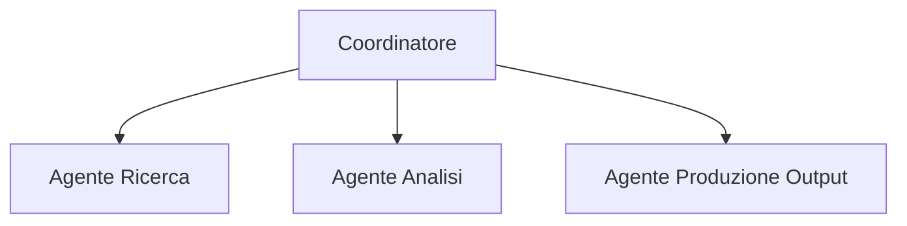
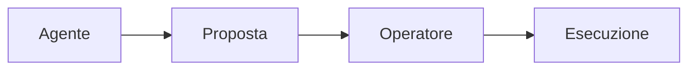
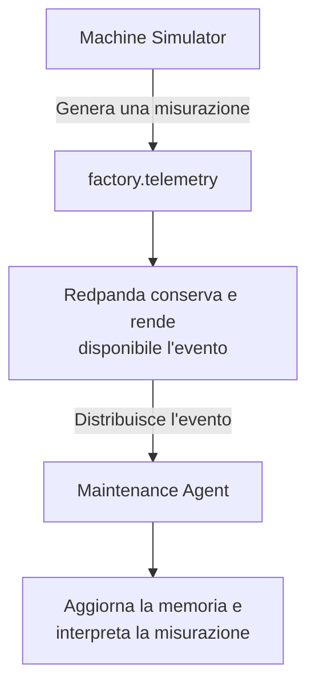
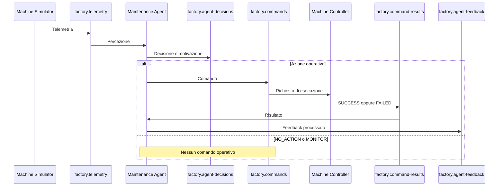

# Agenti software


> **Idea chiave:** un agente non si limita a trasferire dati. Osserva un ambiente, mantiene uno stato, applica una politica decisionale, produce azioni e usa il risultato delle azioni come feedback per l'adattamento.

---

## Che cos'è un agente

Un **agente software** è un sistema che:
1. riceve informazioni da un ambiente;
2. le interpreta rispetto a un obiettivo;
3. sceglie un'azione. 

`Agente = Percezione + Elaborazione + Azione`

Un agente può funzionare con **regole deterministiche**, **modelli statistici**, **tecniche di machine learning** oppure **modelli linguistici**. Un LLM non è quindi un requisito obbligatorio, ma rappresenta lo stato dell'arte per la maggior parte degli agenti moderni.

Le architetture agentiche possono includere **percezione**, **elaborazione**, **decisione**, **azione**, **memoria** e **feedback**. La memoria permette di conservare il **contesto** e di non trattare ogni input come un evento completamente isolato, risultano quindi elementi centrali dei sistemi agentici.



<!--
GitHub visualizza i diagrammi Mermaid direttamente nei file Markdown, quindi il diagramma rimane modificabile insieme al codice sorgente. [GitHub Docs, Creating diagrams](https://docs.github.com/en/get-started/writing-on-github/working-with-advanced-formatting/creating-diagrams)
-->
---

## Tipologie di agenti

Gli agenti possono essere classificati in base al modo in cui **prendono decisioni** e **gestiscono l'interazione con l'ambiente**.

**1. Agenti reattivi** 

Rappresentano la forma più semplice di agente. Non mantengono una rappresentazione complessa dello stato del mondo e rispondono direttamente agli stimoli ricevuti.

Schema logico:

```text
SE condizione X
ALLORA azione Y
```

Esempi:

- termostati;
- sistemi antifurto;
- automazioni basate su regole.

| **Vantaggi** | **Svantaggi** |
|------------|-----------|
| Semplice da implementare| Scarsa capacità di adattamento| 
|Elevata velocità di esecuzione| Assenza di pianificazione a lungo termine|


---

**2. Agenti orientati agli obiettivi**

Prendono decisioni in funzione di un obiettivo da raggiungere.

Non si limitano a reagire agli eventi ma valutano quali azioni consentiranno di raggiungere il risultato desiderato.

```text
Stato attuale
      ↓
  Obiettivo
      ↓
 Pianificazione
      ↓
    Azione
```

Esempi:

- navigatori GPS;
- sistemi di pianificazione automatica;
- assistenti digitali che eseguono attività complesse.


| **Vantaggi** | **Svantaggi** |
|------------|-----------|
| Maggiore flessibilità | Dipendenza dal modello dell'ambiente |
| Efficienza operativa | Richiedono modelli e algoritmi<br>più sofisticati rispetto agli agenti reattivi|

---

**3. Agenti che apprendono**

Migliorano il proprio comportamento attraverso l'esperienza.

Possono utilizzare:

- Machine Learning;
- Deep Learning;
- Reinforcement Learning.

Durante l'esecuzione raccolgono feedback e aggiornano il proprio modello decisionale.

Esempi:

- sistemi di raccomandazione;
- robot autonomi;
- sistemi di previsione.

| **Vantaggi** | **Svantaggi** |
|------------|-----------|
| Riduzione dell'intervento umano | Addestramento costoso
| Le prestazioni aumentano grazie all'esperienza accumulata. | Richiedono dataset sufficienti e di<br>qualità per apprendere correttamente.|

---

**4. Agenti basati su Large Language Model (LLM)**

Gli agenti moderni sono spesso costruiti utilizzando un **Large Language Model (LLM)** come componente di ragionamento.

In questo caso il modello linguistico non rappresenta l'intero agente, ma una delle sue componenti.

Un agente basato su LLM integra generalmente:

- ragionamento tramite modello linguistico;
- memoria contestuale;
- strumenti esterni (*tools*);
- pianificazione delle attività;
- meccanismi di feedback.

Esempi:

- assistenti virtuali;
- copiloti per lo sviluppo software;
- sistemi di automazione documentale.

| **Vantaggi** | **Svantaggi** |
|------------|-----------|
| Comprensione del linguaggio naturale| Necessità di aggiornare continuamente il modello interno | Modelli avanzati possono richiedere infrastrutture e risorse significative
| Possono utilizzare API, database, motori di ricerca e applicazioni esterne | La qualità dei risultati dipende spesso dalla formulazione delle istruzioni|

---

## Architetture di implementazione

La struttura interna di un agente può variare in funzione della complessità del problema da risolvere.

**1. Architettura Single Agent**

Nell'architettura **Single Agent** un unico agente gestisce l'intero processo decisionale.



L'agente si occupa di:

- interpretare la richiesta;
- pianificare le attività;
- utilizzare gli strumenti disponibili;
- produrre il risultato finale.

| **Vantaggi** | **Svantaggi** |
|------------|-----------|
| semplicità architetturale | limitata scalabilità
 minori costi di sviluppo | minor specializzazione delle competenze

---


**2. Architettura Multi-Agent**

In un sistema **Multi-Agent** più agenti specializzati collaborano per raggiungere un obiettivo comune.



Ogni agente svolge una funzione specifica.

Esempio:

- un agente raccoglie informazioni;
- un agente esegue l'analisi;
- un agente genera il risultato finale.

| **Vantaggi** | **Svantaggi** |
|------------|-----------|
| specializzazione delle attività | coordinamento più complesso
  maggiore modularità | gestione della comunicazione tra agenti


---

**3.Human-in-the-Loop**

In alcune applicazioni l'essere umano rimane parte integrante del processo decisionale.



L'agente propone un'azione ma l'esecuzione richiede una validazione umana.

Questa architettura è comune in:

- sanità;
- finanza;
- ambiti regolamentati;
- processi aziendali critici.

---

## Differenza tra agente e programma tradizionale

Un programma tradizionale esegue una **sequenza di istruzioni** definite dallo sviluppatore.

```text
Input → Elaborazione → Output
```

Le regole operative sono generalmente statiche e il comportamento è completamente determinato dalla logica implementata.

Un agente introduce invece ulteriori capacità:

- osservazione dell'ambiente;
- mantenimento dello stato;
- valutazione del contesto;
- selezione autonoma delle azioni;
- utilizzo del feedback;
- eventuale apprendimento.


>La principale differenza consiste quindi nel **livello di autonomia**: mentre un programma tradizionale esegue istruzioni predefinite, un **agente sceglie dinamicamente il comportamento** più appropriato in funzione dello stato dell'ambiente e degli obiettivi assegnati.


---

## Componenti fondamentali di un agente

| Componente | Domanda | Implementazione nel progetto |
|---|---|---|
| Percezione | Che cosa sta accadendo? | Consumo di `factory.telemetry` |
| Memoria | Che cosa è accaduto di recente? | `MachineState` con finestre di temperatura e vibrazione |
| Valutazione | Quanto è rischiosa la situazione? | `risk_engine.py` |
| Decisione | Quale comportamento è opportuno? | `policy.py` |
| Azione | Quale comando deve essere eseguito? | Pubblicazione su `factory.commands` |
| Feedback | L'azione è stata eseguita? | Consumo di `factory.command-results` |
| Audit | Come ricostruisco il processo? | `factory.agent-decisions`, `factory.agent-feedback` e `correlation_id` |

### Percezione

E` il momento in cui l’agente acquisisce informazioni sull’ambiente prima di aggiornare la memoria, calcolare il rischio e prendere una decisione. 

Nel progetto, il `Machine Simulator` pubblica misurazioni strutturate come:

- temperatura;
- vibrazione;
- velocità;
- consumo energetico;
- fase operativa.

Questi dati vengono inseriti in un messaggio JSON e pubblicati sul topic `factory.telemetry`.

Nel progetto un evento di telemetria ha questa struttura:

```json
{
  "event_id": "uuid-evento",
  "correlation_id": "abc-125",
  "machine_id": "machine-01",
  "temperature": 93.94,
  "vibration": 6.82,
  "speed": 1450,
  "energy_consumption": 128.0,
  "phase": "DEGRADING"
}
```

Il `Maintenance Agent` si iscrive al topic di telemetria e riceve ogni nuovo messaggio.

Per l’agente, quindi, ogni messaggio di telemetria rappresenta una nuova osservazione dello stato della macchina:

```python
consumer.subscribe(
    [
        TELEMETRY_TOPIC,
    ]
)
```

L'agente non legge soltanto sensori fisici. In un sistema event-driven, un topic può costituire l'interfaccia percettiva dell'agente.

Il flusso è:



### Memoria e stato interno

Viene conservata una finestra delle ultime misurazioni:

```python
@dataclass
class MachineState:
    machine_id: str
    window_size: int
    temperatures: deque[float] = field(init=False)
    vibrations: deque[float] = field(init=False)
    last_action: str = "NO_ACTION"
```

Le code hanno dimensione massima configurabile:

```python
self.temperatures = deque(maxlen=self.window_size)
self.vibrations = deque(maxlen=self.window_size)
```

Questa è una forma di **memoria a breve termine**. Consente di calcolare medie e trend recenti senza conservare indefinitamente tutti gli eventi. La memoria agentica serve proprio a **mantenere contesto**, ricordare **azioni precedenti** e utilizzare **risultati passati** nelle valutazioni successive.

### Valutazione del rischio

Il file `risk_engine.py` trasforma lo stato della macchina in un punteggio compreso tra `0.0` e `1.0`:

```python
total_risk = (
    temperature_risk * TEMPERATURE_WEIGHT
    + vibration_risk * VIBRATION_WEIGHT
    + trend_risk * TREND_WEIGHT
)

return round(min(total_risk, 1.0), 2)
```

Nel prototipo i pesi sono:

```text
TEMPERATURE_WEIGHT = 0.45
VIBRATION_WEIGHT = 0.45
TREND_WEIGHT = 0.10
```

Questo significa che il 45% del rischio deriva dalla temperatura, 
45% del rischio deriva dalla vibrazione e infine il 10% del rischio deriva dal trend. Il trend indica semplicemente l’andamento recente dei valori nel tempo, verificando se i valori stanno aumentando progressimente nelle ultime misurazioni.

Mentre per quanto riguarda le componenti `temperature_risk`, `vibration_risk` e `trend_risk` vengono calcolate come segue:


```python
    temperature_risk = normalize(
        state.average_temperature(),
        NORMAL_TEMPERATURE,
        CRITICAL_TEMPERATURE,
    )
```

Il sistema con la funziona `normalize` recupera la temperatura media e la confronta con due soglie `NORMAL_TEMPERATURE = 65.0` e `CRITICAL_TEMPERATURE = 90.0` ed il comportamento è:
```text
Temperatura media minore o uguale a 65 °C
→ temperature_risk = 0.0

Temperatura media maggiore o uguale a 90 °C
→ temperature_risk = 1.0

Temperatura media compresa tra 65 °C e 90 °C
→ temperature_risk è un valore proporzionale tra 0.0 e 1.0
```

La seconda componente viene calcolata con:
```python   
    vibration_risk = normalize(
        state.average_vibration(),
        NORMAL_VIBRATION,
        CRITICAL_VIBRATION,
    )
```
Il sistema recupera la vibrazione media e la confronta con due soglie `NORMAL_VIBRATION= 2.0` e `CRITICAL_VIBRATION = 7.0` ed il comportamento è:
```text
Vibrazione media minore o uguale a 2.0
→ vibration_risk = 0.0

Vibrazione media maggiore o uguale a 7.0
→ vibration_risk = 1.0

Vibrazione media compresa tra 2.0 e 7.0
→ vibration_risk è un valore proporzionale tra 0.0 e 1.0
```

Le funzioni non usano direttamente soltanto l'ultima misurazione ricevuta, ma utilizzano le medie calcolate sulla finestra di memoria:

```python
state.average_temperature()
state.average_vibration()
```

Infine la terza componente viene calcolate con:
```python
    trend_risk = calculate_trend_risk(state)
```
Non considera soltanto quanto siano elevati i valori, ma controlla se temperatura e vibrazione stanno aumentando progressivamente nel tempo, considerando le ultime misurazioni. Se non sono ancora presenti tali valori, il sistema non dispone di informazioni sufficienti per stabilire un andamento.


Il punteggio di rischio finale non rappresenta una probabilità scientificamente calibrata di guasto, ma è un indice deterministico, progettato per rendere osservabile il processo decisionale.

### Politica decisionale

Il file `policy.py` converte il rischio in un'azione:

```python
def select_action(risk_score: float) -> str:
    if risk_score >= 0.85:
        return EMERGENCY_STOP

    if risk_score >= 0.65:
        return REQUEST_INSPECTION

    if risk_score >= 0.45:
        return REDUCE_SPEED

    if risk_score >= 0.20:
        return MONITOR

    return NO_ACTION
```

| Intervallo del rischio | Decisione | Effetto operativo |
|---|---|---|
| `< 0.20` | `NO_ACTION` | Nessun comando |
| `0.20 - 0.44` | `MONITOR` | Osservazione più attenta |
| `0.45 - 0.64` | `REDUCE_SPEED` | Comando al controller |
| `0.65 - 0.84` | `REQUEST_INSPECTION` | Richiesta di manutenzione |
| `>= 0.85` | `EMERGENCY_STOP` | Arresto di emergenza |

Separare il calcolo del rischio dalla politica rende il sistema più leggibile e testabile. Le soglie possono cambiare senza riscrivere l'acquisizione degli eventi.

---


## Decisione, comando, risultato e feedback

Questi concetti sono distinti.

| Elemento | Significato | Topic |
|---|---|---|
| Decisione | Valutazione dell'agente | `factory.agent-decisions` |
| Comando | Azione operativa richiesta | `factory.commands` |
| Risultato | Esito tecnico prodotto dal controller | `factory.command-results` |
| Feedback | Conferma che l'agente ha acquisito l'esito | `factory.agent-feedback` |



### Feedback positivo

```json
{
  "correlation_id": "abc-131",
  "action": "REQUEST_INSPECTION",
  "command_result": "SUCCESS",
  "machine_status": "INSPECTION_REQUIRED",
  "feedback_status": "PROCESSED"
}
```

### Feedback negativo

```json
{
  "correlation_id": "abc-130",
  "action": "REDUCE_SPEED",
  "command_result": "FAILED",
  "machine_status": "RUNNING",
  "feedback_status": "PROCESSED"
}
```

`FAILED` e `PROCESSED` non sono in contraddizione:

- `command_result = FAILED` indica che il controller non ha applicato l'azione;
- `feedback_status = PROCESSED` indica che l'agente ha ricevuto e registrato correttamente il fallimento.

Senza feedback, l'agente conoscerebbe soltanto l'intenzione di agire. Con il feedback, l'agente può distinguere tra comando inviato e cambiamento realmente applicato.

---

## Perché il Maintenance Agent è un agente

Il `Maintenance Agent` non è un semplice inoltro di messaggi perché:

1. percepisce telemetria da un ambiente esterno;
2. conserva misurazioni precedenti;
3. calcola uno stato sintetico di rischio;
4. sceglie tra più azioni possibili;
5. spiega la decisione;
6. evita comandi operativi duplicati;
7. riceve l'esito delle azioni;
8. aggiorna lo stato interno dopo il feedback.


---


Il `Maintenance Agent` è principalmente **reattivo**:

```text
riceve una telemetria
→ aggiorna lo stato
→ calcola il rischio
→ reagisce
```

Possiede però una componente più evoluta rispetto a una semplice regola istantanea, perché utilizza:

- una finestra temporale;
- medie recenti;
- trend crescenti;
- ultima azione;
- feedback del controller.

---

## Riferimenti

- IBM, [What are the components of AI agents?](https://www.ibm.com/think/topics/components-of-ai-agents)
- IBM, [What is AI agent memory?](https://www.ibm.com/think/topics/ai-agent-memory)
- Microsoft, [Memory for AI Agents](https://microsoft.github.io/ai-agents-for-beginners/13-agent-memory/)
- Microsoft Learn, [AI Agent Orchestration Patterns](https://learn.microsoft.com/en-us/azure/architecture/ai-ml/guide/ai-agent-design-patterns)
- GitHub Docs, [Creating diagrams](https://docs.github.com/en/get-started/writing-on-github/working-with-advanced-formatting/creating-diagrams)
