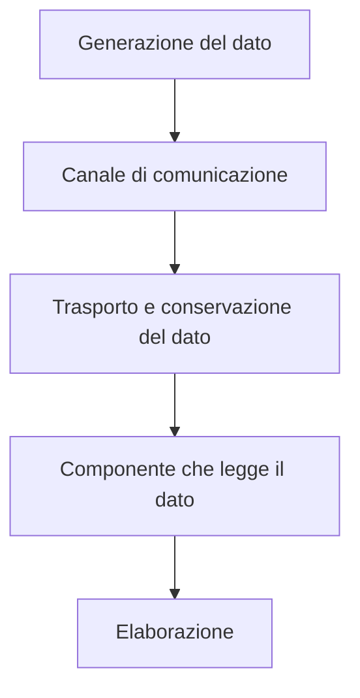
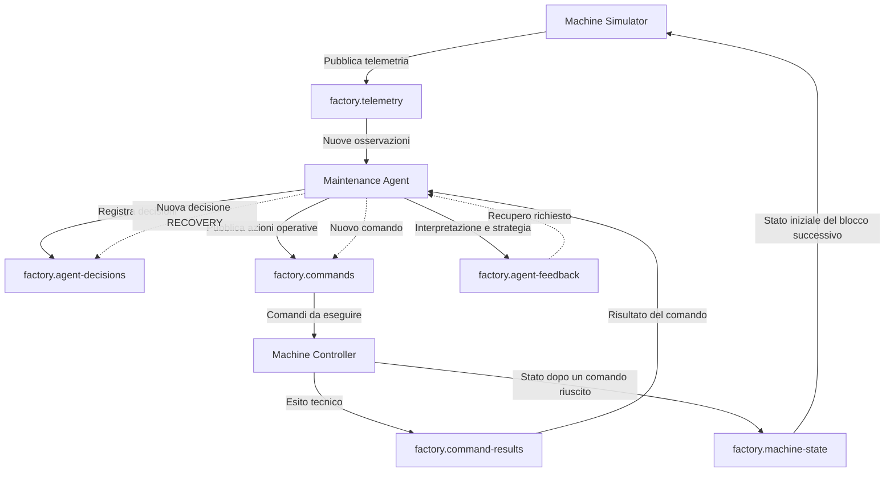

# Agentic Data Plane nella Smart Factory

## Che cos'è un Data Plane

Un **Data Plane** è l'insieme dei componenti e dei meccanismi che permettono ai dati operativi di **attraversare un sistema durante la sua esecuzione**.

Viene spesso chiamato anche **Forwarding Plane** perché si occupa di instradare e movimentare le informazioni da una sorgente a una destinazione.

In un sistema distribuito, il Data Plane gestisce il **flusso concreto delle informazioni tra i diversi servizi**. Non stabilisce necessariamente le regole del sistema, ma permette ai dati di raggiungere tutti i componenti che devono elaborarli.

Il suo funzionamento generale può essere rappresentato così:




---

## Differenza tra Control Plane e Data Plane

Il **Control Plane** e il **Data Plane** svolgono funzioni differenti.

**Control Plane**: definisce configurazioni, regole e politiche. Per esempio, decide quali servizi devono esistere, quali topic devono essere disponibili e quali soglie definiscono un rischio critico.

**Data Plane**: trasporta invece i dati operativi prodotti durante l'esecuzione.

In forma sintetica:


**`Control Plane`**
```text
Definisce come il sistema deve funzionare.
```
**`Data Plane`**
```text
Trasporta e rende disponibili gli eventi prodotti durante il funzionamento.
```

Il file `compose.yaml` appartiene principalmente alla configurazione del sistema, mentre le comunicazioni che attraversano i topic Redpanda costituiscono invece il Data Plane operativo.

Un esempio di configurazione può essere:

```yaml
STATE_WINDOW_SIZE: "5"
MAX_RECOVERY_ATTEMPTS: "3"
SPEED_REDUCTION_PERCENTAGE: "20"
STATE_READ_TIMEOUT_SECONDS: "2"
CONTROLLER_MODE: MIXED
```

---

## Ruoli principali del Data Plane

 
| Ruoli | Descrizione |
|--------|-------------|
| **Trasporto dei dati** | Permette lo spostamento delle informazioni tra sistemi, applicazioni e servizi. |
| **Elaborazione dei messaggi** | Rende gli eventi disponibili ai componenti che devono interpretarli ed elaborarli. |
| **Applicazione delle politiche** | Può implementare controlli di sicurezza, Quality of Service (QoS) e filtri di accesso ai dati. |
| **Ottimizzazione delle prestazioni** | Supporta velocità elevate, bassa latenza ed affidabilità durante la trasmissione delle informazioni. |

---

## Perché è utile utilizzare un Data Plane

L'utilizzo di un Data Plane offre numerosi vantaggi.

- **Separazione delle responsabilità**: distingue la configurazione del sistema dalle operazioni eseguite sui dati , infatti il Control Plane decide, mentre il Data Plane esegue.

- **Maggiore efficienza**: pla movimentazione dei dati può essere ottimizzata indipendentemente dalla logica applicativa.

- **Scalabilità**: permette di gestire grandi volumi di traffico senza aumentare eccessivamente la complessità del sistema. 

- **Sicurezza**: consente di applicare regole e controlli sul traffico dati in modo centralizzato e coerente.
---
## Evoluzione del Data Plane

Il concetto di Data Plane nasce nel settore delle **reti di comunicazione** e delle infrastrutture Internet, dove si è consolidato con la diffusione di router, switch e protocolli di routing moderni. Con l'evoluzione del cloud computing e delle architetture Software Defined Networking (SDN), la **separazione tra Control Plane e Data Plane è diventata sempre più importante**.

Oggi il Data Plane continua a evolversi perché:

- i volumi di dati sono in costante crescita;

- le applicazioni distribuite richiedono tempi di risposta sempre più bassi;

- i sistemi di Intelligenza Artificiale necessitano di accesso rapido e controllato ai dati;

- le organizzazioni devono garantire sicurezza e governance sempre più rigorose.

Per questi motivi il Data Plane è ancora un'area attiva di ricerca e sviluppo.

---

## Che cos'è un Agentic Data Plane

Un **Agentic Data Plane** è un'evoluzione del Data Plane progettato per sostenere il ciclo operativo di uno o più **agenti software**.

L'idea fondamentale è che **non basta più movimentare i dati**. È necessario rendere disponibili agli agenti informazioni contestualizzate, risultati delle azioni e strumenti attraverso cui intervenire sull'ambiente.  

In pratica, un Agentic Data Plane diventa l'infrastruttura che collega:

- agenti AI;

- modelli di machine learning o modelli linguistici (LLM);

- basi di dati;

- applicazioni aziendali;

- strumenti esterni;

- sistemi di monitoraggio e governance.

Nel progetto non viene utilizzato un LLM. Il Maintenance Agent è deterministico e basato su stato, calcolo del rischio, regole decisionali e feedback del controller.

## Come funziona un Agentic Data Plane

Un Agentic Data Plane introduce funzionalità aggiuntive rispetto a un Data Plane tradizionale.

| **Caratteristica** | **Descrizione** |
|------------|-----------|
| **Gestione dell'identità** | Ogni agente possiede una propria identità digitale e opera secondo permessi specifici. |
| **Governance** | Ogni azione compiuta dall'agente viene monitorata, registrata e resa verificabile. |
| **Accesso ai dati** | L'agente può interrogare database, documenti e sistemi aziendali in modo controllato. |
| **Integrazione con strumenti** | Può utilizzare API, servizi cloud, workflow aziendali e altre applicazioni per completare i propri compiti. |
| **Osservabilità** | Tutte le operazioni vengono registrate per facilitare audit, debugging e controllo dei costi. |


---
## Differenze tra Data Plane e Agentic Data Plane

| Data Plane Tradizionale | Agentic Data Plane |
|-------------------------|-------------------|
| Trasporta ed elabora dati | Coordina dati, strumenti e agenti AI. |
| Lavora principalmente su flussi di dati | Lavora su flussi decisionali e operativi. |
| Segue istruzioni del Control Plane | Supporta agenti autonomi che prendono decisioni sulla base del contesto. |
| Gestisce il traffico dati | Gestisce dati, strumenti, permessi e azioni degli agenti. |


## L'Agentic Data Plane realizzato nel progetto

Nel progetto, il Data Plane è formato da:

- Redpanda come broker centrale;
- i topic applicativi;
- le partizioni;
- le chiavi dei record;
- gli offset;
- i producer;
- i consumer;
- i consumer group;
- gli eventi JSON scambiati tra i servizi;
- gli identificatori che collegano telemetrie, decisioni, comandi, risultati e stati.

Redpanda è quindi il **broker di event streaming che costituisce il cuore infrastrutturale del Data Plane**, ma non coincide da solo con l'intero Data Plane.

Il Data Plane completo comprende anche i componenti che producono, consumano e trasformano gli eventi:

- `Machine Simulator`;
- `Maintenance Agent`;
- `Machine Controller`;




---

## Perchè inserire un Broker nel Data Plane

Un Data Plane può funzionare perfettamente senza alcun message broker. Infatti è possibile utilizzare un `API Rest` oppure una `ETL Pipeline` tra il producer e il consumer.

Tuttavia, nelle moderne architetture distribuite e negli Agentic Data Plane, **broker** ed event streaming platform sono spesso utilizzati per facilitare:
- la comunicazione asincrona;
- la scalabilità;
- il disaccoppiamento tra sistemi e agenti;
- la persistenza degli eventi.

Broker si occupa di **gestire lo scambio** tra producer e consumer.

```text
Producer
↓
BROKER
↓
Consumer
```

Data Plane è invece un **concetto architetturale** più ampio, si occupa della movimentazione e della gestione operativa dei dati tra i componenti del sistema.
Può essere composto da:

```text
Data Plane
├── Broker
├── API
├── Database
├── Event Stream
├── Pipeline
├── Tool di monitoraggio
└── Servizi di elaborazione
```

> **Idea chiave**: 
>
> Broker = Strumento 
>
> Data Plane = architettura

---
## Comunicazione asincrona

L'Agentic Data Plane posto alla base del progetto **disaccoppia** i componenti ed evita comunicazioni applicative dirette.

Il **Machine Simulator** non invia richieste HTTP direttamente al **Maintenance Agent**. Allo stesso modo, il **Maintenance Agent** non comunica direttamente con il **Machine Controller** i quest'ultimo non modifica direttamente la memoria del simulator.

Tutte le interazioni avvengono attraverso l'Agentic Data Plane, che funge da livello intermedio di comunicazione e coordinamento.


```text
Comunicazione diretta:
Simulator → Agent → Controller
```

```text
Comunicazione asincrona:
Simulator → topic → Agent → topic → Controller → topic → Simulator
```

Questo disaccoppiamento permette ai componenti di:

- funzionare con velocità differenti;
- essere riavviati separatamente;
- essere sostituiti senza cambiare gli altri servizi;
- processare eventi conservati dal broker;
- essere osservati tramite topic e log.
---

## Adattamento del Data Plane al comportamento agentico

Nel progetto, un normale flusso di eventi è stato adattato alle necessità di un agente attraverso quattro scelte.

### 1. Memoria dell'agente

Il Maintenance Agent conserva una finestra delle misurazioni recenti invece di reagire soltanto all'ultimo evento.

### 2. Decisioni persistenti

Ogni valutazione viene pubblicata in `factory.agent-decisions`, comprese `NO_ACTION`,  `MONITOR` e `STOPPED_OBSERVATION`.

### 3. Separazione tra decisione ed esecuzione

L'agente sceglie l'azione e pubblica un comando. Il Machine Controller valida ed esegue il comando e ne pubblica il risultato.

Questa separazione evita che il componente decisionale applichi direttamente modifiche alla macchina.

### 4. Feedback reattivo

Il risultato ritorna all'agente tramite `factory.agent-feedback`.

Se il comando riesce, l'agente pubblica:

```text
feedback_status = COMPLETED
```

Se il comando fallisce, l'agente può pubblicare:

```text
feedback_status = RECOVERY_SCHEDULED
```

Il fallimento genera quindi una nuova decisione `RECOVERY` e un nuovo comando.


### 5. Stato effettivo della macchina

Dopo un comando riuscito, il controller pubblica il nuovo stato in `factory.machine-state`.

Esempi:

```text
REDUCE_SPEED riuscito
→ velocità risultante ridotta
→ stato RUNNING

REQUEST_INSPECTION riuscito
→ velocità invariata
→ stato INSPECTION_REQUIRED

EMERGENCY_STOP riuscito
→ velocità risultante 0
→ stato STOPPED
```

La nuova telemetria non riparte quindi sempre dai valori iniziali, ma riflette l'ultimo intervento riuscito.
---

## Riferimenti

- IBM, **Control Plane vs. Data Plane**: <https://www.ibm.com/think/topics/control-plane-vs-data-plane>
- Redpanda, **Introducing the Agentic Data Plane**:<https://www.redpanda.com/blog/agentic-data-plane>
- Redpanda **Agentic Data Plane**:<https://www.redpanda.com/agentic-data-plane>
