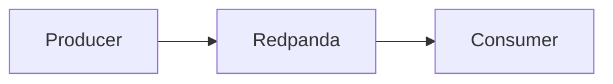
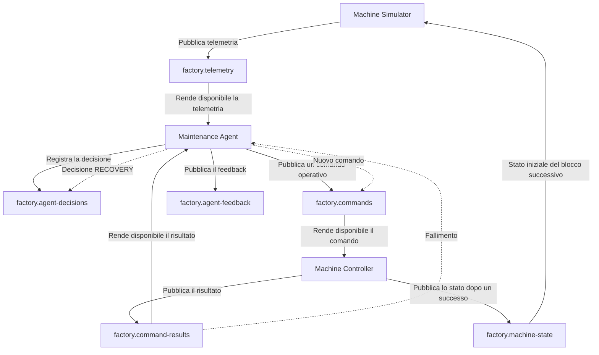

# Redpanda


## Che cos'è Redpanda

Redpanda è una piattaforma di **event streaming** compatibile con il protocollo Kafka, progettata per consentire la gestione e l'elaborazione di flussi di eventi in tempo reale.

> **Idea chiave:** nel progetto, Redpanda è il **broker di event streaming** utilizzato come componente centrale per implementare il Data plane.

Una piattaforma di event streaming riceve eventi prodotti dalle applicazioni,cioè  i  `producer`, li conserva in sequenza e li rende disponibili ad altre applicazioni che devono elaborarli, i `consumer`. 



Redpanda organizza gli eventi in **topic**, cioè flussi logici dedicati a categorie specifiche di dati.


Redpanda non coincide con l'intero Data Plane. Il Data Plane comprende anche topic, partizioni, producer, consumer, consumer group, offset ed eventi, mentre Redpanda è il broker centrale che riceve, conserva e distribuisce questi eventi.

---

## A che cosa serve Redpanda

L'importanza di Redpanda deriva principalmente dall'evoluzione dei moderni sistemi software.
Le applicazioni contemporanee richiedono infatti:

- elaborazione in tempo reale;
- elevata scalabilità;
- comunicazione asincrona;
- riduzione delle dipendenze tra servizi;
- gestione di grandi volumi di dati;
- osservabilità dei flussi applicativi.

In scenari di questo tipo, una comunicazione diretta tra applicazioni può generare **elevato accoppiamento** e **ridurre la flessibilità dell'intera architettura**.

Redpanda introduce invece un **meccanismo di comunicazione basato sugli eventi** che consente ai diversi componenti di collaborare senza conoscere direttamente l'implementazione degli altri servizi.

Il modello generale è:

```text
Producer
        ↓
pubblica un evento
        ↓
Broker Redpanda
        ↓
conserva l'evento in un topic
        ↓
Consumer
        ↓
legge ed elabora l'evento
```

Questa struttura favorisce una **comunicazione asincrona**. Il producer può pubblicare un evento senza attendere che il consumer completi immediatamente tutta l'elaborazione.

---

# Principali casi di utilizzo

| Utilizzo | Descrizione |
|-----------|-------------|
| **Broker** | Riceve eventi dai sistemi che li generano e li distribuisce alle applicazioni interessate. |
| **Event Streaming** | Conserva gli eventi nei topic e li rende disponibili in tempo reale a uno o più consumer. |
| **Microservizi** | Consente la comunicazione asincrona tra servizi indipendenti. |
| **Data Pipeline** | Permette il trasferimento delle informazioni dalle sorgenti dati ai sistemi di elaborazione, ai Data Lake e ai database. |
| **Sistemi AI e Agentic Architecture** | Supporta la comunicazione tra agenti intelligenti attraverso lo scambio di eventi. |

---

## Producer, broker e consumer

### 1. Producer

Un producer è un'applicazione che crea e pubblica eventi.

Nel progetto sono producer:

```text
Machine Simulator
Maintenance Agent
Machine Controller
```

Le responsabilità sono:

- il `Machine Simulator` pubblica la telemetria in `factory.telemetry`;
- il `Maintenance Agent` pubblica decisioni, comandi e feedback;
- il `Machine Controller` pubblica risultati e aggiornamenti dello stato macchina.

### 2. Broker
Il broker riceve e conserva gli eventi, quindi li rende disponibili ai consumer.

Nel progetto il broker è:

```text
Redpanda
```

### 3. Consumer

Un consumer legge ed elabora eventi presenti in uno o più topic.

Nel progetto sono consumer:

```text
Maintenance Agent
Machine Controller
Machine Simulator
```

Le responsabilità sono:

- il `Maintenance Agent` consuma `factory.telemetry` e `factory.command-results`;
- il `Machine Controller` consuma `factory.commands`;
- il `Machine Simulator` consuma `factory.machine-state` prima di generare un nuovo blocco.

Anche il Machine Simulator è quindi sia producer sia consumer: pubblica le telemetrie e legge lo stato risultante dagli interventi precedenti.

---

## Redpanda nel progetto

Il flusso completo è:




Il `Machine Simulator` non conosce il codice del `Maintenance Agent`. Conosce soltanto il broker e i topic necessari:

```text
broker = redpanda:9092
telemetry topic = factory.telemetry
machine state topic = factory.machine-state
```


Allo stesso modo, il `Maintenance Agent` non chiama direttamente il `Machine Controller`, ma pubblica un evento in `factory.commands`, che il controller legge in modo indipendente.
Il `Machine Controller` non modifica direttamente il simulatore. Dopo un comando riuscito pubblica il nuovo stato in `factory.machine-state`, che verrà letto dal simulator all'avvio del blocco successivo.

---

## I topic del progetto

Il progetto usa sei topic applicativi:

```text
factory.telemetry
factory.agent-decisions
factory.commands
factory.command-results
factory.agent-feedback
factory.machine-state
```

### `factory.telemetry`

```text
event_id
correlation_id
machine_id
timestamp
sequence_number
temperature
vibration
speed
energy_consumption
phase
status
simulation_mode
simulation_scenario
source_state_event_id
source_state_correlation_id
```

I campi principali descrivono i valori telemetrici, lo stato operativo e lo scenario utilizzato dal simulatore.

I riferimenti `source_state_event_id` e `source_state_correlation_id` collegano il nuovo blocco all'ultimo stato macchina disponibile.

### `factory.agent-decisions`

Contiene le valutazioni del Maintenance Agent.

Le decisioni possono essere:

```text
INITIAL
→ generate da una telemetria

RECOVERY
→ generate dal fallimento di un comando
```

I campi principali sono:

```text
decision_id
decision_type
source_event_id
source_result_id
parent_decision_id
parent_command_id
correlation_id
risk_score
average_temperature
average_vibration
average_speed
current_speed
previous_action
previous_command_result
selected_action
recovery_attempt
reason
```

Anche `NO_ACTION`, `MONITOR` e `STOPPED_OBSERVATION` vengono registrate nel topic, pur non generando comandi operativi.


### `factory.commands`
Contiene le azioni operative richieste al controller:

```text
REDUCE_SPEED
REQUEST_INSPECTION
EMERGENCY_STOP

I campi principali sono:

```text
command_id
decision_id
correlation_id
decision_type
action
risk_score
current_speed
target_speed
recovery_attempt
reason
```

`current_speed` rappresenta la velocità conosciuta prima dell'azione, mentre `target_speed` rappresenta la velocità da raggiungere.

Per esempio:

```text
REDUCE_SPEED
current_speed = 1500
target_speed = 1200
```

```text
EMERGENCY_STOP
current_speed = 1500
target_speed = 0
```

### `factory.command-results`

Contiene il risultato prodotto dal Machine Controller:

```text
SUCCESS
FAILED
```
I campi principali sono:

```text
result_id
command_id
decision_id
correlation_id
controller_id
action
result
previous_speed
target_speed
resulting_speed
machine_status
state_changed
failure_reason
failure_code
retryable
execution_number
```

Un comando fallito non modifica la velocità:

```text
result = FAILED
resulting_speed = previous_speed
state_changed = false
```

Un arresto di emergenza riuscito produce:

```text
result = SUCCESS
resulting_speed = 0
machine_status = STOPPED
state_changed = true
```

### `factory.agent-feedback`

Contiene il modo in cui il Maintenance Agent interpreta il risultato del controller.

Gli stati principali sono:

```text
COMPLETED
→ il comando è riuscito

RECOVERY_SCHEDULED
→ il comando è fallito ed è stata scelta una nuova azione

MANUAL_INTERVENTION_REQUIRED
→ è stato superato il numero massimo di tentativi automatici
```

I campi principali sono:

```text
feedback_id
result_id
command_id
decision_id
correlation_id
command_result
feedback_status
current_speed
machine_status
state_changed
recovery_required
next_action
recovery_attempt
max_recovery_attempts
message
```

In caso di fallimento recuperabile, il feedback indica la nuova azione. Il Maintenance Agent pubblica poi una decisione `RECOVERY` e un nuovo comando con lo stesso `correlation_id`.

### `factory.machine-state`

Contiene lo stato effettivo della macchina dopo un comando eseguito con successo.

I campi principali sono:

```text
state_event_id
source_result_id
source_command_id
source_decision_id
correlation_id
controller_id
machine_id
timestamp
speed
previous_speed
target_speed
status
last_applied_action
state_changed
```

Il Machine Controller pubblica in questo topic solamente quando il comando ha risultato `SUCCESS`.

Il Machine Simulator legge lo stato più recente e seleziona il blocco successivo:

```text
Nessuno stato precedente
→ PROGRESSIVE_DEGRADATION

Ultima azione REDUCE_SPEED
→ RECOVERY_AFTER_SPEED_REDUCTION

Stato INSPECTION_REQUIRED
→ INSPECTION_PENDING

Stato STOPPED
→ STOPPED_COOLING
```

---

## Pubblicazione degli eventi nel codice

Il Machine Simulator pubblica la telemetria con:

```python
producer.produce(
    topic=TELEMETRY_TOPIC,
    key=event[
        "machine_id"
    ].encode("utf-8"),
    value=json.dumps(
        event
    ).encode("utf-8"),
    callback=handle_delivery,
)
```

I parametri principali sono:


**1. Topic**: Indica dove deve essere salvato l'evento.

**2. Key**: Identifica la macchina e influenza la scelta della partizione.

**3. Value**: Contiene il messaggio JSON.

**4. Callback**: Comunica se Redpanda ha accettato il record.


Il Maintenance Agent e il Machine Controller utilizzano lo stesso modello per pubblicare decisioni, comandi, risultati e feedback e stati macchina.

Nel progetto i messaggi utilizzano machine_id come chiave. In questo modo gli eventi della stessa macchina vengono indirizzati in modo coerente alla stessa partizione.

---

## Consumo degli eventi nel codice

Il Maintenance Agent crea un consumer:

```python
configuration = {
    "bootstrap.servers": KAFKA_BROKER,
    "group.id": CONSUMER_GROUP,
    "auto.offset.reset": "earliest",
    "enable.auto.commit": False,
}
```

Poi dichiara quali topic vuole leggere:

```python
consumer.subscribe(
    [
        TELEMETRY_TOPIC,
        COMMAND_RESULTS_TOPIC,
    ]
)
```

L'agente controlla periodicamente se sono disponibili messaggi:
```python
message = consumer.poll(
    timeout=1.0
)
```     

Il Machine Controller utilizza lo stesso modello per leggere `factory.commands`.

Il Machine Simulator crea invece un consumer temporaneo per leggere gli stati presenti in `factory.machine-state`:

```python
consumer.subscribe(
    [MACHINE_STATE_TOPIC]
)
```

Il simulator utilizza un consumer group univoco per rileggere il topic dall'inizio e individuare lo stato più recente associato a `machine-01`.

---

## Topic, partizioni e chiavi

Ogni topic del progetto ha tre partizioni.

```text
partizione 0
partizione 1
partizione 2
```

e partizioni permettono di distribuire i dati e il lavoro tra più consumer. L'ordine è garantito all'interno della singola partizione, non globalmente tra tutte le partizioni.


Gli eventi usano `machine_id` come chiave:

```python
key=machine_id.encode("utf-8")
```
Poiché il progetto utilizza attualmente una sola macchina, `machine-01`, gli eventi della stessa macchina vengono indirizzati alla stessa partizione. Le altre partizioni rimangono disponibili per eventuali macchine aggiuntive e per una futura elaborazione parallela.

---

## Offset e consumer group

L'offset è la posizione progressiva di un record all'interno di una partizione.

```text
offset 0
offset 1
offset 2
```

Un consumer group permette alle istanze della stessa applicazione di coordinarsi e di registrare fino a quale offset sono arrivate.
Nel progetto sono presenti i gruppi permanenti:

```text
maintenance-agent-group-v2
machine-controller-group-v2
```

Il Machine Simulator usa invece un identificatore temporaneo con una struttura simile a:

```text
machine-simulator-state-reader-machine-01-<uuid>
```

Questo gruppo temporaneo consente a ogni esecuzione del simulator di rileggere gli stati disponibili e selezionare quello più recente.

Il commit viene eseguito manualmente dopo l'elaborazione:

```python
consumer.commit(
    message=message,
    asynchronous=False,
)
```

Il commit sincrono registra l'offset soltanto dopo l'elaborazione del messaggio.

Il consumer lag rappresenta il numero di record disponibili che un consumer group non ha ancora elaborato.

```text
LAG = 0
```

significa che, nel momento dell'osservazione, il consumer group ha raggiunto l'ultimo record disponibile nelle partizioni assegnate.


---


## Configurazione Docker di Redpanda

Redpanda viene avviato con:

```yaml
redpanda:
  image: redpandadata/redpanda:v26.2.1
  container_name: redpanda
```

La modalità locale è:

```yaml
command:
  - redpanda
  - start
  - --mode
  - dev-container
```


---
## Redpanda Console

Redpanda Console è l'interfaccia grafica accessibile da:

```text
http://localhost:8081
```

È fondamentale per osservare:

- topic;
- messaggi JSON;
- partizioni e offset;
- decisioni dell'agente;
- risultati `SUCCESS` e `FAILED`;
- feedback.

---

## Correlation ID

Redpanda assegna partizione e offset, ma questi valori non collegano automaticamente record presenti in topic differenti.

Per questo il progetto usa:

```text
correlation_id
```

Lo stesso valore viene propagato nel ciclo originato da una singola telemetria:

```text
factory.telemetry
        ↓
factory.agent-decisions
        ↓
factory.commands
        ↓
factory.command-results
        ↓
factory.agent-feedback
```

Se il comando fallisce, lo stesso `correlation_id` viene mantenuto anche per:

```text
nuova factory.agent-decisions con decision_type = RECOVERY
        ↓
nuovo factory.commands
        ↓
nuovo factory.command-results
        ↓
nuovo factory.agent-feedback

Quando un comando ha esito positivo, lo stesso identificatore viene riportato anche in factory.machine-state
```

---

## Che cosa Redpanda fa e non fa

Redpanda:

- riceve eventi;
- conserva eventi;
- organizza record in topic e partizioni;
- assegna offset;
- rende i record disponibili;
- coordina i consumer group;
- conserva lo storico necessario per audit e replay;
- rende osservabili i flussi tramite Redpanda Console.

Redpanda non:

- genera la telemetria;
- calcola medie e trend;
- calcola il rischio;
- seleziona azioni;
- esegue comandi;
- modifica direttamente lo stato della macchina;
- decide se un comando deve riuscire o fallire.

Queste responsabilità appartengono rispettivamente al `Machine Simulator`, al `Maintenance Agent` e al `Machine Controller`.


---

## Riferimenti

- Redpanda Documentation, Introduction to Redpanda: <https://docs.redpanda.com/streaming/current/get-started/intro-to-events/>
- Redpanda Documentation, Streaming: <https://docs.redpanda.com/streaming/current/home/>
- Redpanda Documentation, rpk: <https://docs.redpanda.com/streaming/current/reference/rpk/>
- Redpanda Documentation, Kafka client compatibility: <https://docs.redpanda.com/streaming/current/develop/kafka-clients/>
