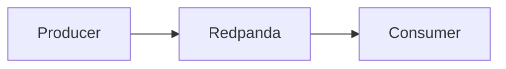
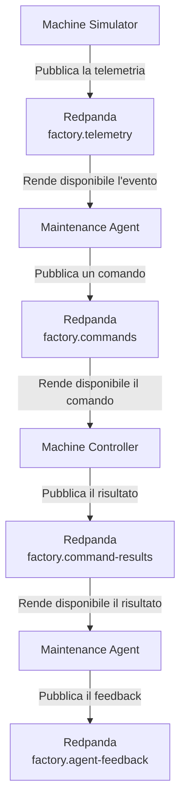

# Redpanda

## Che cos'è Redpanda

Redpanda è una piattaforma di **event streaming** compatibile con il protocollo Kafka, progettata per consentire la gestione e l'elaborazione di flussi di eventi in tempo reale.

> **Idea chiave:** nel progetto, Redpanda è il **broker di event streaming** utilizzato come componente centrale per implementare il Data plane.

Una piattaforma di event streaming riceve eventi prodotti dalle applicazioni, i  `producer`, li conserva in sequenza e li rende disponibili ad altre applicazioni che devono elaborarli, i `consumer`. 



Redpanda organizza gli eventi in **topic**, cioè flussi logici dedicati a categorie specifiche di dati.


Redpanda non coincide con l'intero Data Plane. Il Data Plane comprende anche topic, partizioni, producer, consumer, consumer group, offset ed eventi, mentre Redpanda è il broker centrale che riceve, conserva e distribuisce questi eventi.

---

## A che cosa serve Redpanda

L'importanza di Redpanda deriva principalmente dall'evoluzione dei moderni sistemi software.
Le applicazioni contemporanee richiedono infatti:

- elaborazione in tempo reale;
- elevata scalabilità;
- comunicazione asincrona;
- riduzione delle dipendenze tra servizi;
- gestione di grandi volumi di dati.

In scenari di questo tipo, una comunicazione diretta tra applicazioni può generare **elevato accoppiamento** e **ridurre la flessibilità dell'intera architettura**.

Redpanda introduce invece un **meccanismo di comunicazione basato sugli eventi** che consente ai diversi componenti di collaborare senza conoscere direttamente l'implementazione degli altri servizi.

Il modello generale è:

```text
Producer
        ↓
pubblica un evento
        ↓
Broker Redpanda
        ↓
conserva l'evento in un topic
        ↓
Consumer
        ↓
legge ed elabora l'evento
```

Questa struttura favorisce una **comunicazione asincrona**. Il producer può pubblicare un evento senza attendere che il consumer completi immediatamente tutta l'elaborazione.

---

# Principali casi di utilizzo

| Utilizzo | Descrizione |
|-----------|-------------|
| **Broker** | Riceve eventi dai sistemi che li generano e li distribuisce alle applicazioni interessate. |
| **Event Streaming** | Gli eventi prodotti vengono conservati all'interno dei topic e possono essere elaborati in tempo reale da uno o più consumer. |
| **Microservizi** | Consente la comunicazione asincrona tra servizi indipendenti all'interno di architetture basate su microservizi. |
| **Data Pipeline** | Permette il trasferimento delle informazioni dalle sorgenti dati ai sistemi di elaborazione, ai Data Lake e ai database. |
| **Sistemi AI e Agentic Architecture** | Supporta la comunicazione tra agenti intelligenti attraverso lo scambio di eventi. |

---

## Producer, broker e consumer

### 1. Producer

Un producer è un'applicazione che crea e pubblica eventi.

Nel progetto sono producer:

```text
Machine Simulator
Maintenance Agent
Machine Controller
```

Il Machine Simulator produce telemetrie, mentre il Maintenance Agent produce decisioni, comandi e feedback e infine il Machine Controller produce risultati.

### 2. Broker

Il broker riceve e conserva gli eventi, quindi li rende disponibili ai consumer.

Nel progetto il broker è:

```text
Redpanda
```

### 3. Consumer

Un consumer legge ed elabora eventi presenti in uno o più topic.

Nel progetto sono consumer:

```text
Maintenance Agent
Machine Controller
```

Il Maintenance Agent consuma telemetrie e risultati invece il Machine Controller consuma comandi.

Uno stesso servizio può essere sia producer sia consumer.

---

## Redpanda nel progetto

Il flusso completo è:



Il Machine Simulator non conosce il codice del Maintenance Agent, conosce soltanto il broker e il topic dove deve pubblicare gli eventi:

```text
broker = redpanda:9092
topic = factory.telemetry
```

Allo stesso modo, il Maintenance Agent non chiama direttamente il Machine Controller, ma pubblica un evento su `factory.commands`, che il Controller legge in modo indipendente.

---

## I topic del progetto

Il progetto usa cinque topic applicativi:

```text
factory.telemetry
factory.agent-decisions
factory.commands
factory.command-results
factory.agent-feedback
```

### `factory.telemetry`

Contiene le misurazioni della macchina:

```text
temperatura
vibrazione
velocità
consumo energetico
```

### `factory.agent-decisions`

Contiene le valutazioni del Maintenance Agent:

```text
risk_score
previous_action
selected_action
reason
```

### `factory.commands`

Contiene soltanto le azioni che richiedono un intervento:

```text
REDUCE_SPEED
REQUEST_INSPECTION
EMERGENCY_STOP
```

`NO_ACTION` e `MONITOR` non producono comandi.

### `factory.command-results`

Contiene il risultato prodotto dal Machine Controller:

```text
SUCCESS
FAILED
```

### `factory.agent-feedback`

Contiene la conferma che il Maintenance Agent ha ricevuto e interpretato il risultato del Controller.

---

## Pubblicazione degli eventi nel codice

Il Machine Simulator pubblica la telemetria con:

```python
producer.produce(
    topic=TELEMETRY_TOPIC,
    key=event["machine_id"].encode("utf-8"),
    value=json.dumps(event).encode("utf-8"),
    callback=handle_delivery,
)
```

I parametri principali sono:


**1. Topic**: Indica dove deve essere salvato l'evento.

**2.Key**: Identifica la macchina e influenza la scelta della partizione.

**3.Value**: Contiene il messaggio JSON.

**4. Callback**: Comunica se Redpanda ha accettato il record.


Il Maintenance Agent e il Machine Controller utilizzano lo stesso modello per pubblicare decisioni, comandi, risultati e feedback.

---

## Consumo degli eventi nel codice

Il Maintenance Agent crea un consumer:

```python
configuration = {
    "bootstrap.servers": KAFKA_BROKER,
    "group.id": CONSUMER_GROUP,
    "auto.offset.reset": "earliest",
    "enable.auto.commit": False,
}
```

Poi dichiara quali topic vuole leggere:

```python
consumer.subscribe(
    [
        TELEMETRY_TOPIC,
        COMMAND_RESULTS_TOPIC,
    ]
)
```

L'agente controlla periodicamente se sono disponibili messaggi:

```python
message = consumer.poll(timeout=1.0)
```

Il Machine Controller applica lo stesso modello per leggere `factory.commands`.

---

## Topic, partizioni e chiavi

Ogni topic del progetto ha tre partizioni.

```text
partizione 0
partizione 1
partizione 2
```

Le partizioni permettono di distribuire dati e lavoro e di garantire l'ordine all'interno della singola partizione. Al momento per scopo didattico del progetto viene utilizzata una sola partizione, ma sono disponibili anche le altre nel momento in cui ci saranno più istanze per il consumer.

Gli eventi usano `machine_id` come chiave:

```python
key=event["machine_id"].encode("utf-8")
```


---

## Offset e consumer group

L'offset è la posizione progressiva di un record all'interno di una partizione.

```text
offset 0
offset 1
offset 2
```

Il consumer group permette a un'applicazione consumer di registrare fino a quale offset è arrivata, in modo tale che due applicazioni possano leggere in contemporanea due topic senza interferire tra di loro.

Nel progetto sono presenti:

```text
maintenance-agent-group
machine-controller-group
```

Il commit viene eseguito manualmente dopo l'elaborazione:

```python
consumer.commit(
    message=message,
    asynchronous=False,
)
```

Questo permette al consumer di riprendere dalla posizione registrata dopo un riavvio.

Durante le verifiche, entrambi i gruppi hanno mostrato:

```text
STATE = Stable
TOTAL-LAG = 0
```

`LAG = 0` significa che non erano presenti record ancora da elaborare.

---

## Persistenza tramite volume Docker

Redpanda salva i dati nel volume:

```yaml
volumes:
  - redpanda-data:/var/lib/redpanda/data
```

Il volume conserva i dati separatamente dal ciclo di vita del container.

Un normale arresto non elimina automaticamente:

- topic;
- messaggi;
- offset;
- metadati.

Il comando:

```bash
docker compose down
```

rimuove i container ma mantiene normalmente il volume.

Il comando:

```bash
docker compose down -v
```

rimuove anche il volume e azzera i dati locali.

---

## Configurazione Docker di Redpanda

Redpanda viene avviato con:

```yaml
redpanda:
  image: redpandadata/redpanda:v26.2.1
  container_name: redpanda
```

La modalità locale è:

```yaml
command:
  - redpanda
  - start
  - --mode
  - dev-container
```

<!--
---

## rpk e Redpanda Console

### rpk

`rpk` è lo strumento a riga di comando di Redpanda.

Nel progetto è stato usato per:

- creare ed eliminare topic;
- elencare i topic;
- consumare record di prova;
- descrivere consumer group;
- controllare offset e lag;
- verificare la salute del broker.

Esempio:

```bash
docker exec redpanda rpk topic list
```
-->
---
## Redpanda Console

Redpanda Console è l'interfaccia grafica accessibile da:

```text
http://localhost:8080
```

È fondamentale per osservare:

- topic;
- messaggi JSON;
- partizioni e offset;
- decisioni dell'agente;
- risultati `SUCCESS` e `FAILED`;
- feedback.

---

## Correlation ID

Redpanda assegna partizione e offset, ma questi valori non collegano automaticamente record presenti in topic differenti.

Per questo il progetto usa:

```text
correlation_id
```

Lo stesso valore viene propagato attraverso:

```text
factory.telemetry
        ↓
factory.agent-decisions
        ↓
factory.commands
        ↓
factory.command-results
        ↓
factory.agent-feedback
```

Il `correlation_id` permette di ricostruire l'intera catena relativa a una specifica telemetria.

---

## Che cosa Redpanda fa e non fa

Redpanda:

- riceve eventi;
- conserva eventi;
- organizza record in topic e partizioni;
- assegna offset;
- rende i record disponibili;
- coordina i consumer group.

Redpanda non:

- genera la telemetria;
- calcola medie e trend;
- calcola il rischio;
- seleziona azioni;
- esegue comandi;
- decide se un comando deve riuscire o fallire.

Queste responsabilità appartengono a Machine Simulator, Maintenance Agent e Machine Controller.


---

## Riferimenti

- Redpanda Documentation, Introduction to Redpanda: <https://docs.redpanda.com/streaming/current/get-started/intro-to-events/>
- Redpanda Documentation, Streaming: <https://docs.redpanda.com/streaming/current/home/>
- Redpanda Documentation, rpk: <https://docs.redpanda.com/streaming/current/reference/rpk/>
- Redpanda Documentation, Kafka client compatibility: <https://docs.redpanda.com/streaming/current/develop/kafka-clients/>
