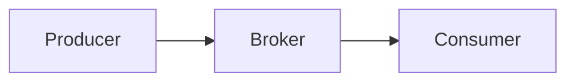

# Redpanda e Apache Kafka a confronto

Redpanda e Apache Kafka sono piattaforme di **event streaming distribuito** in grado di gestire flussi di eventi in tempo reale e svolgere il ruolo di infrastruttura per la comunicazione asincrona tra applicazioni, microservizi e sistemi distribuiti.

> **Idea chiave**: Redpanda nasce infatti con l'obiettivo di offrire un'esperienza **compatibile con Kafka**, semplificando al contempo la gestione dell'infrastruttura e migliorando le prestazioni.

---

## Cosa hanno in comune

Sia Kafka che Redpanda sono progettati per:

- gestire flussi continui di eventi
- supportare architetture event-driven;
- consentire la comunicazione asincrona tra servizi;
- garantire elevata disponibilità e tolleranza ai guasti;
- scalare orizzontalmente tramite cluster;
- supportare pattern publish/subscribe;
- memorizzare gli eventi all'interno di topic.

In entrambi i casi il principio di funzionamento è il medesimo:



## Differenze principali

| Aspetto | Redpanda | Apache Kafka |
|---|---|---|
| Tipologia | Risulta più semplice da installare, configurare e mantenere| Il funzionamento richiedeva componenti aggiuntivi per la gestione del cluster |
|Prestazioni| Ottime anche con infrastrutture relativamente contenute, permette di ridurre la latenza e massimizzare il throughput | Estremamente elevate, è stato progettato per gestire carichi molto importanti con miliardi di eventi ogni giorno|
| Implementazione | Broker implementato con un motore nativo in C++ | Broker eseguito sulla JVM |
| Gestione dei metadati | Utilizza una propria architettura basata su Raft | Nelle versioni moderne utilizza KRaft |
| Strumento da terminale | Utilizza principalmente `rpk` | Utilizza gli strumenti e gli script della distribuzione Kafka |
| Interfaccia grafica | Può essere utilizzato con Redpanda Console | Non include una singola interfaccia grafica predefinita nel progetto Apache |
| Compatibilità Kafka | Supporta molte API e molti client Kafka, con alcune eccezioni | Rappresenta l'implementazione originale del protocollo Kafka |
| Complessità di gestione | Punta sulla semplicità operativa, ridotto il numero di compomenti da amministrare | Estremamente potente ma richiede una maggiore conoscenza dell'infrastruttura |


---

## Differenza nell'implementazione

Apache Kafka viene eseguito sulla **Java Virtual Machine**.

Redpanda utilizza invece un **motore nativo implementato in C++** e non richiede la JVM per eseguire il broker.

Questa differenza riguarda principalmente il **funzionamento interno delle piattaforme**. Il modello applicativo rimane simile:

```text
Producer
        ↓
Topic
        ↓
Consumer
```

Nel progetto, Redpanda viene avviato con:

```yaml
redpanda:
  image: redpandadata/redpanda:v26.2.1
  container_name: redpanda
```

Se il progetto utilizzasse Kafka, sarebbe necessario sostituire il servizio Redpanda con un servizio Kafka e configurare diversamente il **broker** e la **gestione dei metadati**.

---

## Differenza nella gestione dei metadati

Le versioni moderne di Apache Kafka, in sostituzione a Zookeeper, utilizzano **KRaft** per la gestione distribuita dei metadati del cluster. 
In modalità KRaft, alcuni nodi Kafka assumono il ruolo di `controller` e partecipano a un quorum. I controller mantengono un **registro condiviso dei metadati** e devono raggiungere un consenso sulle modifiche alla configurazione del cluster.

Redpanda invece utilizza una propria architettura basata su **Raft**. 
Raft è un algoritmo di consenso che permette a più nodi di concordare sullo stesso stato anche in presenza di alcuni guasti. Un nodo opera come leader, mentre gli altri replicano le informazioni come follower. Una modifica viene considerata confermata quando viene accettata dalla maggioranza dei nodi del gruppo. Redpanda utilizza quindi Raft non soltanto per i **metadati**, ma anche per la **replica dei dati** applicativi contenuti nelle partizioni.


---

## Differenza nell'interfaccia grafica

Nel progetto viene utilizzata **Redpanda Console**.

La Console permette di osservare:

- topic;
- messaggi JSON;
- chiavi;
- partizioni;
- offset;
- consumer group;
- lag;
- decisioni dell'agente;
- risultati `SUCCESS` e `FAILED`;
- `correlation_id`.

**Apache Kafka non include una singola interfaccia** grafica predefinita nel progetto Apache. Per ottenere una visualizzazione simile è necessario scegliere e configurare uno strumento compatibile.

---

## Che cosa hanno in comune Redpanda e Kafka

Redpanda e Kafka condividono il modello fondamentale dell'event streaming.

**1. Producer**: crea e pubblica eventi.


**2. Broker**: riceve, conserva e distribuisce gli eventi.

**3. Consumer**: legge ed elabora gli eventi.


**4. Topic**: entrambe le piattaforme organizzano gli eventi in topic.

**5. Partizioni**: Redpanda e Kafka possono dividere ogni topic in più partizioni, queste permettono di:

- distribuire i record;
- mantenere l'ordine all'interno di una partizione;
- aumentare il parallelismo;
- dividere il lavoro tra più consumer.

**6. Chiavi**: entrambe le piattaforme permettono di associare una chiave ai record. Gli eventi della stessa macchina vengono così indirizzati coerentemente verso la stessa partizione del relativo topic.

**7. Offeset**: Redpanda e Kafka assegnano a ogni record un offset all'interno della partizione, rappresentando la posizione del record nella partizione.

**8. Consumer Group**: entrambe le piattaforme supportano i consumer group che registrano l'avanzamento dell'applicazione e permetteno a più istanze dello stesso consumer di dividersi le partizioni.

---
# Quando utilizzare Kafka

Kafka rappresenta spesso la scelta migliore quando:

- l'organizzazione possiede già un ecosistema Kafka consolidato;
- sono presenti cluster di grandi dimensioni;
- è richiesta una piattaforma ampiamente collaudata;
- si opera in contesti enterprise molto complessi;
- sono necessari strumenti altamente specializzati dell'ecosistema Kafka.

---
# Quando utilizzare Redpanda

Redpanda rappresenta una scelta molto interessante quando:

- si desidera ridurre la complessità operativa;
- si vuole una soluzione più semplice da gestire;
- si sta sviluppando una nuova architettura cloud-native;
- si necessita di elevate prestazioni con infrastruttura ridotta;
- si realizzano sistemi basati su eventi, AI Agent o architetture agentiche;
- si desidera una compatibilità con Kafka senza adottarne tutta la complessità.

---

## Compatibilità con il client Python

Il progetto utilizza:

```python
from confluent_kafka import Consumer, Producer
```

La libreria `confluent-kafka` comunica attraverso il protocollo Kafka e può essere utilizzata con Redpanda.

La configurazione del consumer usa proprietà compatibili con Kafka:

```python
configuration = {
    "bootstrap.servers": KAFKA_BROKER,
    "group.id": CONSUMER_GROUP,
    "auto.offset.reset": "earliest",
    "enable.auto.commit": False,
}
```

Anche la pubblicazione segue il modello Kafka:

```python
producer.produce(
    topic=topic,
    key=machine_id.encode("utf-8"),
    value=json.dumps(event).encode("utf-8"),
    callback=delivery_report,
)
```

Questa compatibilità favorisce la **portabilità** del codice applicativo.

Redpanda e Kafka non sono identici, ma gran parte del codice Python potrebbe essere riutilizzata passando da una piattaforma all'altra.

---

## Perché nel progetto è stato utilizzato Redpanda

Redpanda è stato scelto perché permette di realizzare un ambiente di sviluppo locale **semplice** e soprattutto **chiaramente osservabile**.

### 1. Avvio attraverso Docker Compose

Il file `compose.yaml` contiene il broker, la Console, il simulatore, il Maintenance Agent e il Machine Controller.

Questa configurazione permette di avviare l'intera architettura con pochi comandi.

### 2. Compatibilità con `confluent-kafka`

Redpanda permette di utilizzare il client Python scelto per il progetto:

```text
confluent-kafka
```

Non è stato quindi necessario utilizzare una libreria specifica e proprietaria per produrre o consumare eventi.


### 3. Disponibilità di Redpanda Console

Redpanda Console permette di vedere graficamente i messaggi presenti nei topic.

Questa funzione è particolarmente utile in un progetto accademico perché permette di seguire facilmente il percorso di ogni evento.

### 4. Osservazione del ciclo agentico

Attraverso Redpanda Console è possibile seguire lo stesso `correlation_id` nei diversi topic:

```text
factory.telemetry
        ↓
factory.agent-decisions
        ↓
factory.commands
        ↓
factory.command-results
        ↓
factory.agent-feedback
```

Questo rende più semplice dimostrare il funzionamento del Maintenance Agent.

---

## Vantaggi di Redpanda nel progetto

I principali vantaggi osservati nel progetto sono:

1. avvio locale semplice tramite Docker Compose;
2. compatibilità con il client Python `confluent-kafka`;
3. interfaccia grafica tramite Redpanda Console;
4. visualizzazione immediata dei messaggi JSON;
5. controllo di partizioni e offset;
6. osservazione dei consumer group e del lag;
7. persistenza degli eventi;
8. tracciabilità tramite `correlation_id`;
9. supporto alla comunicazione asincrona tra i servizi.


---

## Che cosa cambierebbe usando Kafka

La logica principale del progetto potrebbe rimanere quasi invariata.

Cambierebbero principalmente gli aspetti infrastrutturali:

1. immagine Docker del broker;
2. configurazione KRaft;
3. listener e porte;
4. inizializzazione dello storage;
5. health check;
6. strumenti amministrativi;
7. interfaccia grafica;
8. procedure di avvio e manutenzione.

Il broker configurato nei servizi potrebbe diventare:

```yaml
KAFKA_BROKER: kafka:9092
```

Potrebbero restare uguali:

- Machine Simulator;
- Maintenance Agent;
- Risk Engine;
- policy decisionale;
- Machine Controller;
- eventi JSON;
- nomi dei topic;
- `machine_id`;
- `correlation_id`;
- consumer group;
- gestione degli offset.


Il client Python potrebbe continuare a essere:

```python
from confluent_kafka import Consumer, Producer
```

Questo dimostra che la logica della Smart Factory è separata dalla tecnologia specifica utilizzata come broker.


---

## Riferimenti

- Redpanda Documentation, How Redpanda Works: <https://docs.redpanda.com/streaming/current/get-started/architecture/>
- Redpanda Documentation, Kafka Compatibility: <https://docs.redpanda.com/streaming/current/develop/kafka-clients/>
- Redpanda Documentation, rpk: <https://docs.redpanda.com/streaming/current/reference/rpk/>
- Apache Kafka official website: <https://kafka.apache.org/>
- Apache Kafka Documentation, KRaft: <https://kafka.apache.org/documentation/#kraft>